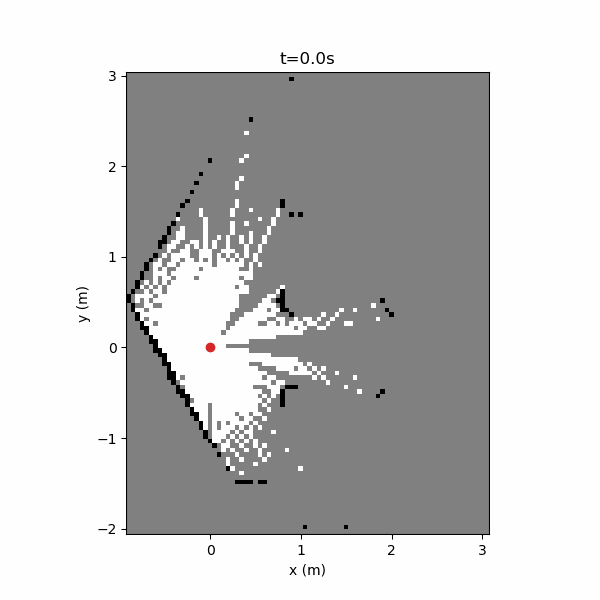

# Nav2-SLAM Resilience Benchmark

ROS 2 benchmark for measuring Nav2 and slam_toolbox degradation and recovery under controlled LiDAR faults in Gazebo.



## Why I Built It

Robotics stacks often report their own health. I wanted the fault boundary to be measured against Gazebo ground truth, recorded sensor behavior, and mission outcomes instead of relying on a single status topic.

## What It Does

A TurtleBot3 drives a fixed course in Gazebo while Nav2 and slam_toolbox run normally. The benchmark routes LiDAR through controlled dropout or noise conditions, records the trial, and grades localization, map health, navigation success, collisions, and recovery time.

## Key Engineering Work

- Built strict YAML scenario loading with type, range, and unknown-key validation.
- Routed scan faults deterministically without changing Nav2 or slam_toolbox internals.
- Added bag extraction, pose synchronization, and independent ground-truth grading.
- Implemented recovery-window, map-staleness, navigation, and collision metrics.
- Added data-quality gates so failed or unsynchronized trials cannot masquerade as results.
- Added 77 unit tests and a containerized Gazebo/ROS 2 demo path.

## Architecture

```text
Gazebo LiDAR → fault router → /scan_for_slam → slam_toolbox → Nav2
      │              │                                  │
      └──────────────┴──── rosbag + Gazebo ground truth ┘
                                  │
                           independent metrics
```

The benchmark owns the scenario contract, fault routing, extraction, and grading. Gazebo, Nav2, slam_toolbox, TurtleBot3, and `topic_tools` remain external components.

## Results

An isolated dropout trial measured 5.001 Hz before the fault, 4.030 Hz during injection, and 4.999 Hz after recovery. Independent localization grading produced approximately 0.0149 m RMSE. The repository also includes baseline, 10 Hz dropout, severe dropout, and high-noise captures.

The full severity sweep is not claimed as a finished statistical study. This is simulation-only, single-robot evidence and should not be generalized to physical LiDAR failure or hardware safety.

## Tech Stack

ROS 2 Jazzy, Nav2, slam_toolbox, Gazebo Harmonic, TurtleBot3, `topic_tools`, Python, rosbag2, Docker, pytest, and Ruff.

## Running Locally

```bash
python3 -m venv .venv
source .venv/bin/activate
pip install -e . pyyaml pytest ruff
pytest tests/unit -q
```

The complete Gazebo path is containerized:

```bash
scripts/dev_shell.sh
scripts/run_demo.sh
```

The container path requires Docker and takes substantially longer than the pure metrics tests. Apache-2.0 License.
